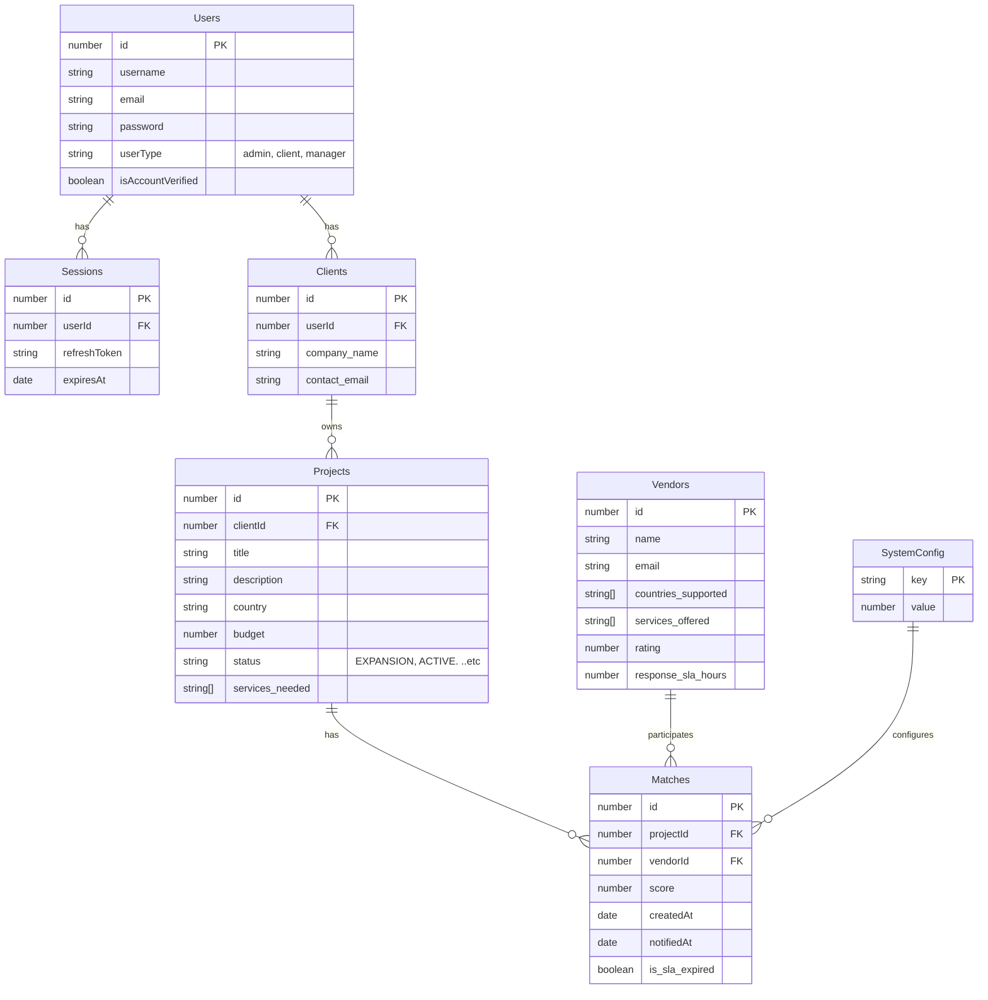
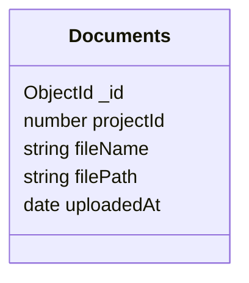

# Expanders360API - NestJS Backend Application

A comprehensive NestJS backend application with dual database support (PostgreSQL + MongoDB), advanced security features, and robust API endpoints.

## 🚀 Features

- **Dual Database Architecture**: PostgreSQL (TypeORM) + MongoDB (Mongoose)
- **Advanced Security**: Helmet, Rate Limiting, CORS, Compression
- **Authentication**: JWT-based authentication with session management
- **File Management**: Secure file uploads with Multer
- **Email System**: Nodemailer integration for notifications
- **Role-Based Access Control**: Admin, Client, and Vendor roles
- **Matching System**: Automated matching between projects and vendors
- **Analytics**: Insights on top vendors and document counts per country
- **Docker Support**: Complete containerization setup

## 🛡️ Security Features

### 1. HTTP Security Headers (Helmet)
The application uses Helmet to set various HTTP headers for security:

- **Content-Security-Policy**: Restricts resource loading to prevent XSS attacks
- **Strict-Transport-Security**: Enforces HTTPS with 1-year max age
- **X-Frame-Options**: Prevents clickjacking attacks
- **X-Content-Type-Options**: Prevents MIME type sniffing
- **X-XSS-Protection**: Additional XSS protection layer

### 2. Rate Limiting
- **Limit**: 100 requests per 15 minutes per IP address
- **Headers**: RateLimit-Limit, RateLimit-Remaining, RateLimit-Reset
- **Scope**: Applied globally to all endpoints

### 3. CORS Configuration
- **Origin**: Allows all origins (configurable)
- **Credentials**: Supports authenticated requests
- **Methods**: GET, POST, PUT, PATCH, DELETE, OPTIONS
- **Headers**: Content-Type, Authorization

### 4. Response Compression
- **Algorithm**: Gzip compression for all responses
- **Performance**: Reduces bandwidth usage and improves load times

### 5. Input Validation
- **DTO Validation**: Class-validator decorators for all inputs
- **Whitelist**: Only allows validated properties
- **Transformation**: Automatic type conversion and sanitization

## 🗄️ Database Architecture

### PostgreSQL (TypeORM)
- **Entities**: Users, Sessions, Clients, Projects, Vendors, Matches, SystemConfig, Countries, Services
- **Features**: ACID compliance, complex queries, transactions
- **Use Case**: User management, business logic, relational data

### MongoDB (Mongoose)
- **Collections**: Documents
- **Features**: Schema flexibility, document storage, aggregation
- **Use Case**: File metadata, analytics data, flexible schemas


## 📊 Schema Diagrams

Below are simplified schema diagrams for the main entities and collections used in the application.

### PostgreSQL Schema (TypeORM)


### MongoDB Schema (Mongoose)


## 📝 API List

Below is a list of the main API endpoints provided by the application. All endpoints are prefixed with `/api/v1`.

| Method | Endpoint | Description | Authentication |
|--------|----------|-------------|----------------|
| POST   | `/auth/login` | Authenticate a user and return JWT tokens | Public |
| POST   | `/auth/register` | Register a new user and send email with confirm-token | Public |
| POST   | `/auth/verify-email/:token` | Verify a user's email using provided token to activate account | Public |
| POST   | `/auth/refresh` | Generate a new JWT access token using a valid refresh token | Public |
| POST   | `/auth/logout` | Invalidate the current session for a user, logging them out | Public |
| POST   | `/auth/logoutAllDevices` | Invalidate all sessions for a user across all devices | Public |
| POST   | `/auth/forgotPassword` | Initiate password reset process and send reset code email | Public |
| POST   | `/auth/verifyResetCode` | Verify the password reset code sent to the user's email | Public |
| POST   | `/auth/resetPassword` | Verify the password reset code sent to the user's email | Public |
| POST   | `/Vendors` | Create a new vendor with details like name, services, and supported countries | Admin only |
| GET    | `/Vendors` | Retrieve all Vendors with optional filtering and pagination | Admin or Client |
| GET    | `/Vendors/:id` | Get a specific Vendor by ID  | Admin or Client |
| Patch  | `/Vendors/:id` | Update a specific Vendor by ID  | Admin |
| Delete | `/Vendors/:id` | Delete a specific Vendor by ID  | Admin |
| POST   | `/Projects` | Create a new Project | Client only |
| GET    | `/Projects` | Retrieve all Projects with optional filtering and pagination | Admin or Client owner |
| GET    | `/Projects/:id` | Get a specific Project by ID  | Admin or Client Owner |
| Patch  | `/Projects/:id` | Update a specific Project by ID  | Admin or Client Owner |
| Delete | `/Projects/:id` | Get a specific Project by ID  | Admin or Client Owner |
| POST   | `/projects/:id/matches/rebuild` | Rebuild matches for a specific project based on vendor compatibility | Admin or Client owner |
| GET    | `/projects/:id/matches/all` | Get all matches for a specific project | Admin or Client |
| GET    | `/matches` | Retrieve all matches with optional filtering and pagination | Admin only |
| GET    | `/matches/:id` | Get a specific match by ID | Admin only |
| DELETE | `/matches/:id` | Delete a specific match by ID | Admin only |
| POST   | `/system-configs` | Create a new System-config | Admin only |
| GET    | `/system-configs` | Retrieve all System-configs | Admin only |
| GET    | `/system-configs/:id` |  Get a specific System-config by ID | Admin only |
| Patch  | `/system-configs/:id` |  Update a specific System-config by ID | Admin only |
| DELETE | `/system-configs/:id` | Delete a specific System-config by ID | Admin only |
| GET    | `/analytics/top-vendors` | Retrieve top 3 vendors per country with average match scores and document counts | Admin only |
| GET    | `/analytics/vendors-by-country/:countryId` | Retrieve vendors per country with average match scores and document counts | Admin only |
| POST   | `/documents/upload` | Upload a document for a project | Client |
| GET    | `/documents/:projectId` | Get all documents for a project | Client |
.. etc

## 🧮 Matching Formula

The matching system calculates a score for each vendor-project match based on the following formula:

```
Score = (Services Overlap × Services Overlap Multiplier) + Vendor Rating + SLA_Weight
```

### Components
- **Services Overlap**: Number of common services between `project.services_needed` and `vendor.services_offered`.
- **Services Overlap Multiplier**: Configurable value (default: 2) to weight the importance of service overlap.
- **Vendor Rating**: A numerical rating of the vendor (e.g., 0-5).
- **SLA Weight**: Calculated as `sla_weight_base / (response_sla_hours + 1)`, capped between 0 and 2.
  - `sla_weight_base`: Configurable value (default: 20).
  - `response_sla_hours`: Vendor's SLA response time in hours.
  - If SLA is expired or `response_sla_hours` is invalid, SLA Weight = 0.

### Example
- Project needs: `["web", "mobile"]`
- Vendor offers: `["web", "design"]`
- Services Overlap: 1 (only "web" is common)
- Services Overlap Multiplier: 2
- Vendor Rating: 3
- SLA Weight: `20 / (4 + 1) = 4` (assuming `response_sla_hours = 4`)

**Calculation**:
```
Score = (1 × 2) + 3 + 4 = 8
Final Score = 8.00 (rounded to 2 decimal places)
```

## 🚀 Getting Started

### Prerequisites
- Node.js 18+
- PostgreSQL 15+
- MongoDB 7+
- Docker & Docker Compose


### Installation

1. **Clone the repository**
```bash
git clone https://github.com/HadyHashiam/Expanders360API.git
cd Expanders360API-main
```

2. **Install dependencies**
```bash
npm install
```

3. **Environment Setup**
Create `.env.development` file:
```env
NODE_ENV=development
PORT=

# Database PostgreSQL
DB_USERNAME=postgres
DB_PASSWORD=
DB_NAME=
DB_HOST=
DB_PORT=5432
DB_SSL=false

# MongoDB
MONGO_URI=

# JWT
JWT_SECRET=your-jwt-secret
JWT_REFRESH_SECRET=your-refresh-secret

# Session
JWT_SECRET_KEY=
JWT_REFRESH_SECRET_KEY=
JWT_ACCESS_EXPIRE_TIME=
JWT_REFRESH_EXPIRE_TIME=

# Email (Gmail example)
EMAIL_HOST=smtp.gmail.com
EMAIL_PORT=587
EMAIL_USER=
EMAIL_PASSWORD=
```


4. **DB creation, migrations and seeds**
```bash
# Create DB if not exists (using env)
npm run db:create

# Apply migrations (Postgres)
npm run migration:run

# Seed Postgres data
npm run seed

# Mongo DB
npm run seed:mongo 

```


5. **Start with Docker or local**
```bash
# Development environment
docker-compose -f docker-compose.dev.yml up -d

# Production environment
docker-compose up -d
```


5. **Run the application**
```bash
# Development
npm run start:dev
```

## 📁 Project Structure

```
src/
├── Modules/                 # Feature modules
│   ├── auth/               # Authentication & authorization
│   ├── users/              # User management
│   ├── documents/          # File management
│   ├── projects/           # Project management
│   ├── matches/            # Matching system
│   ├── analytics/          # Analytics & reporting
│   └── vendor/             # Vendor management
├── config/                  # Configuration files
│   ├── database.config.ts  # Database configuration
│   ├── jwt.config.ts       # JWT configuration
│   └── security.config.ts  # Security settings
├── utils/                   # Utility functions
│   ├── apifeature/         # Pagination - Search - Sort - Filter
│   ├── handlerFactory/     # CURD Factory
│   ├── interfaces/         # validate  interfaces
│   ├── middleware/         # Custom middleware
│   ├── pipes/              # Validation pipes
│   └── interceptors/       # Response interceptors
└── main.ts                 # Application entry point
```

## 🔐 Security Headers Explained
### Rate Limiting Headers
```
RateLimit-Policy: 100;w=900          # 100 requests per 15 minutes (900 seconds)
RateLimit-Limit: 100                 # Maximum requests allowed
RateLimit-Remaining: 99              # Remaining requests in current window
RateLimit-Reset: 900                 # Seconds until rate limit resets
```

### Other Security Headers
```
Strict-Transport-Security            # Enforce HTTPS
X-Frame-Options: SAMEORIGIN         # Prevent clickjacking
X-Content-Type-Options: nosniff     # Prevent MIME sniffing
X-XSS-Protection: 0                 # XSS protection (modern browsers handle this)
```

## 🐳 Docker Configuration

### Development Environment
```yaml
# docker-compose.dev.yml
services:
  app:
    build: .
    ports:
      - "3000:3000"
    environment:
      - NODE_ENV=development
    volumes:
      - .:/app
      - /app/node_modules
```

### Production Environment
```yaml
# docker-compose.yml
services:
  app:
    build: .
    ports:
      - "3000:3000"
    environment:
      - NODE_ENV=production
    depends_on:
      - postgres
      - mongodb
```

## 📧 Email Configuration

### Gmail Setup
1. Enable 2-factor authentication
2. Generate App Password
3. Use App Password in MAIL_PASS

### SMTP Configuration
```typescript
// src/Modules/mailer/mailer.module.ts
MailerModule.forRootAsync({
  useFactory: (config: ConfigService) => ({
    transport: {
      host: config.get('MAIL_HOST'),
      port: config.get('MAIL_PORT'),
      secure: false,
      auth: {
        user: config.get('MAIL_USER'),
        pass: config.get('MAIL_PASS'),
      },
    },
  }),
})
```

## 🚨 Troubleshooting

### Email Issues
If you encounter "Unexpected socket close" errors:
1. Check SMTP credentials
2. Verify network connectivity
3. Check firewall settings
4. Use App Password for Gmail

### Security Headers
All security headers are automatically applied. If you need to modify them:
1. Edit `src/config/security.config.ts`
2. Restart the application

### Rate Limiting
If you hit rate limits:
1. Reduce request frequency
2. Implement client-side rate limiting
3. Check for multiple requests from same IP

## 🔄 Development Workflow

1. **Start development environment**
   ```bash
   docker-compose -f docker-compose.dev.yml up -d
   npm run start:dev
   ```

2. **Test APIs using REST Client files**
   - Use VS Code REST Client extension
   - Update tokens in auth.http after login
   - Test all endpoints systematically

3. **Database operations**
   ```bash
   # Generate migrations
   npm run migration:generate -- -n MigrationName
   
   # Run migrations
   npm run migration:run
   
   # Seed database
   npm run seed
   ```

## 📝 API Documentation

### Base URL
```
http://localhost:3000/api/v1
```

### Authentication
All protected endpoints require JWT token in Authorization header:
```
Authorization: Bearer <jwt-token>
```

### Common Response Format
```json
{
  "status": "success",
  "message": "Operation completed",
  "data": { ... }
}
```

## 🤝 Contributing

1. Fork the repository
2. Create a feature branch
3. Make your changes
4. Test thoroughly
5. Submit a pull request


**Note**: This application is configured for development use. For production deployment, ensure all security settings are properly configured and secrets are securely managed.
